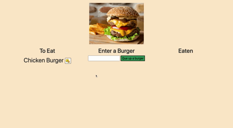

# burger-eater

## Description
An applicatoin that allows users to que up burgers to eat, eat them and then hide the evidence. It

## Usage
Enter a burger you would like to eat in the text area. The Burger will then pop in the *To Eat* section, if you hit the button next to the burgers name it will move to the *Eaten* section, if you hit the button next the burger then it will dissapear. 

## Technologies 
- Node.js
- express
- express handlebars
- css 
- html
- javascript
- jquery
- mysql

## Questions
If you have any questions about the app please feel free to contact me at mspringberry＠gmail.com

## Live Site
https://protected-sierra-50593.herokuapp.com
